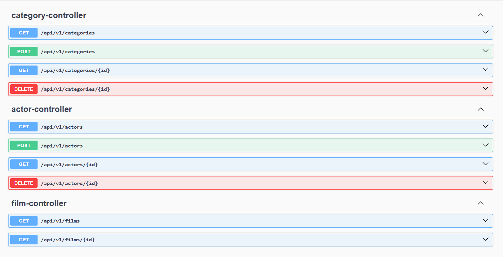

# Films API

Ein kleines Backend-Projekt mit einer REST-API zur Verwaltung von Filmen, Schauspielern und Kategorien.

Als Grundlage für das Projekt wurde die bereits bestehende Beispieldatenbank Pagila verwendet. Auf Basis ihrer Datenstruktur wird die REST-API entwickelt und schrittweise um eigene Funktionen ergänzt.

Das Projekt wurde erstellt, um die Entwicklung von REST-Services mit Spring Boot, die Implementierung von API-Controllern sowie die Dokumentation von Endpunkten mit OpenAPI und Swagger UI praktisch zu üben.

> **Projektstatus:** In Entwicklung.  
> Die Funktionen für Schauspieler und Kategorien sind bereits verfügbar. Die Funktionalität für Filme wird derzeit noch erweitert.

## Technology stack

- Java
- Spring Boot 4.1.0
- Spring Web MVC
- JOOQ
- REST API
- springdoc-openapi
- Swagger UI
- Maven
- PostgreSQL

